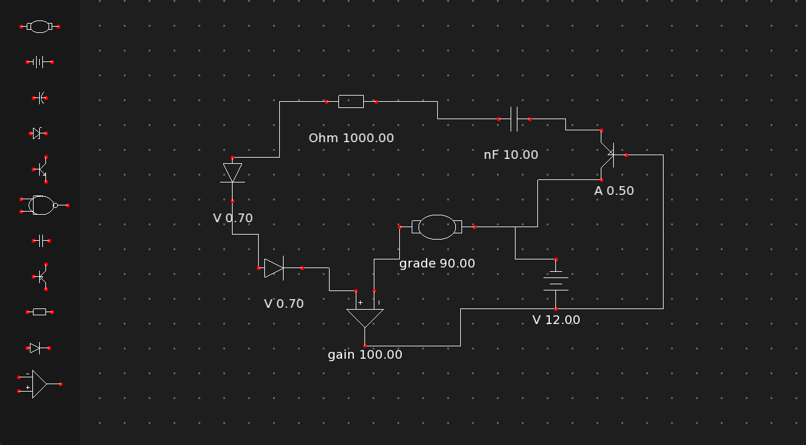

# Electron

A C++ visualizer for electronic schemes.

## Overview

Electron is a desktop application built in C++ that provides visualization and interaction capabilities for electronic circuit diagrams and schematics. The project uses modern C++ development practices and includes build automation tools for cross-platform compilation.



## Features

- **Electronic Scheme Visualization** - View and interact with circuit diagrams
- **Cross-Platform Support** - Built with Windows (batch scripts) and Unix-like systems (Makefile) in mind
- **Project Management** - Save and load your circuit designs
- **Component Editing** - Modify component values and properties
- **Automatic Wire Routing** - Intelligent wire routing that avoids components
- **Zooming & Panning** - Navigate and zoom in/out of your circuits

## Controls

### Keyboard Commands

| Key                | Action                                                          |
|--------------------|-----------------------------------------------------------------|
| **Ctrl+W**         | Close the application                                           |
| **Escape**         | Cancel current action (stop wiring, deselect, stop editing)     |
| **R**              | Rotate selected component (90° increments)                      |
| **Delete**         | Delete selected component                                       |
| **E**              | Enter edit mode for selected component's value                  |
| **0-9, ., Backspace** | Modify component value (digits, decimal point, delete char)  |
| **Ctrl+S**         | Save circuit to file (prompts for filename in console)          |
| **Ctrl+O**         | Load circuit from file (prompts for filename in console)        |

### Mouse Commands

| Action                  | Function                                                    |
|-------------------------|-------------------------------------------------------------|
| **Left Click**          | Select component / Spawn from menu / Start or complete wiring (when clicking component pins) |
| **Right Click + Drag**  | Pan the viewport                                            |
| **Mouse Wheel Scroll**  | Zoom in/out canvas (no selection) or zoom component (if any selected) |
| **Mouse Drag (selected)** | Move selected component around canvas                      |


## Project Structure

```
electron/
├── src/                    # Source code (C++ implementation)
├── assets/                 # Static assets and resources
├── saves/                  # Saved circuit/project files
├── Makefile               # Unix/Linux build configuration
├── run.bat                # Windows batch script for running the application
├── .vscode/               # VS Code editor configuration
├── .gitignore             # Git ignore rules
└── README.md              # This file
```

## Getting Started

### Prerequisites

- C++ compiler (C++11 or later)
- Make (for Unix/Linux builds)
- Windows batch support (for Windows builds)

### Building the Project

#### On Unix/Linux:
```bash
make
```

#### On Windows:
```bash
run.bat
```

### Running the Application

The `run.bat` script is provided for Windows users to compile and run the application.

For Unix/Linux users, the Makefile handles both compilation and can be extended to run the compiled executable.

## Authors

**[amcbn06](https://github.com/amcbn06)** **[tibinyte](https://github.com/tibinyte)**

---

*Last updated: 2026-03-02*
